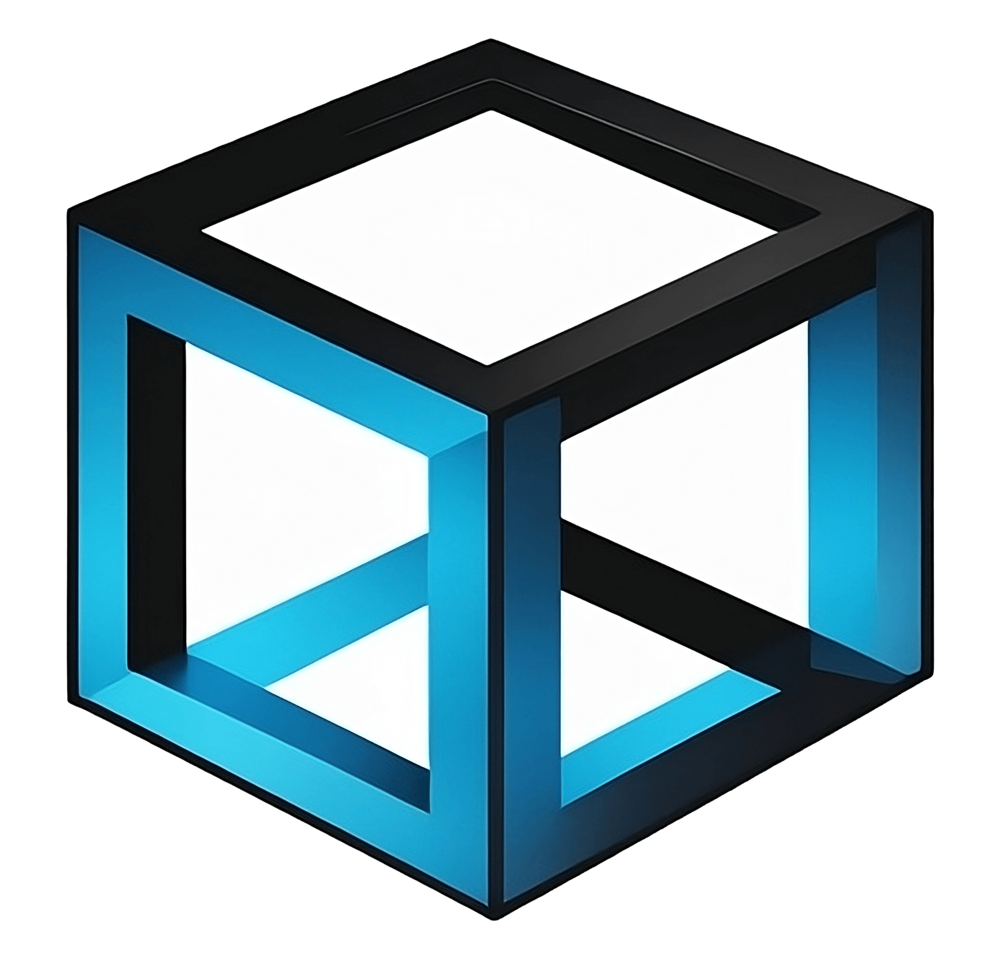

# Bloc Blog

Bloc Blog – by [@AladdineDev](https://github.com/AladdineDev)

[](https://flutter.dev/)
[](https://dart.dev/)
[](https://firebase.google.com/)

## Features ✨

💙 [Bloc](https://bloclibrary.dev) state management and architecture\
💙 [Firestore](https://firebase.google.com/docs/firestore) real-time pagination\
💙 Multi-platform (Android, iOS)

## Getting started 🚀

If you haven't already, install [Flutter](https://docs.flutter.dev/get-started/install)

**1. Clone this repository**

```bash
git clone https://github.com/AladdineDev/bloc_blog
cd bloc_blog
```

**2. Install dependencies:**

```bash
flutter pub get
```

**3. Run the app:**

```bash
flutter pub run
```

## License 📄

This project is licensed under the MIT License - see the [LICENSE](https://github.com/AladdineDev/bloc_blog/blob/main/LICENSE.md) file for details
